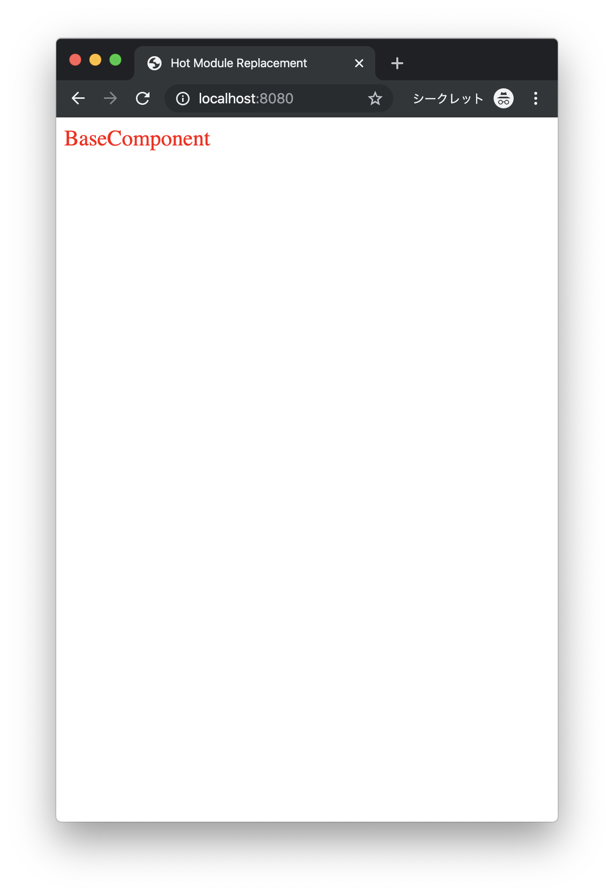

# The Minimum implementation of react project written in tsc react webpack package sample

## purpose
### - Usage of build a start-up react project with typescript
### - Learning the usage of webpack

## points
### - Webpack resolve the *.tsx files with the usage of ts-loader
### - Webpack resolve the *.css files with the usage of style-loader and css-loader

## process
### - npm install
### - npm run serve

## preview

